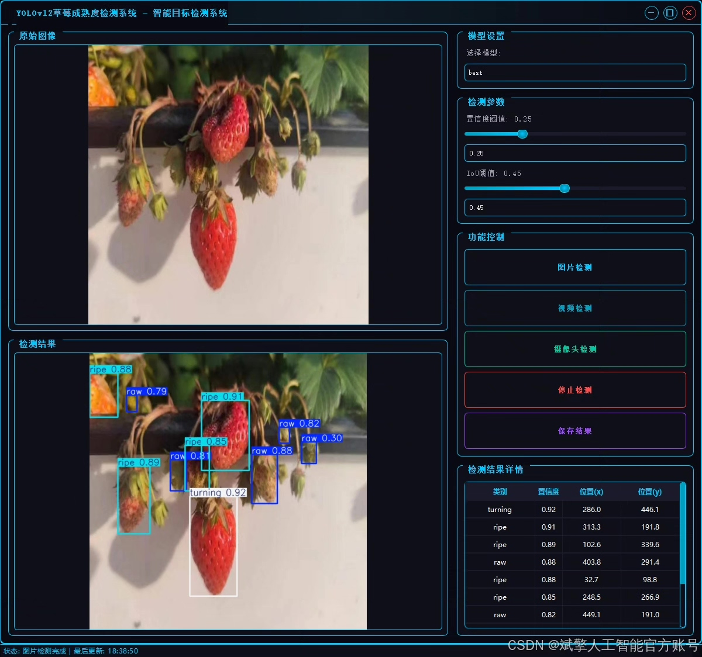
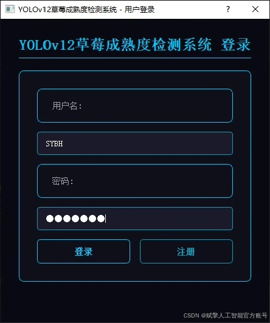
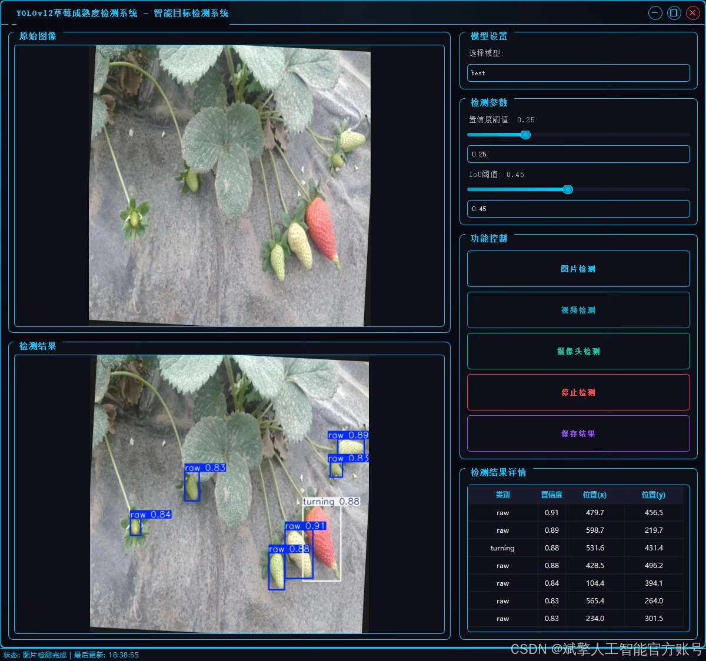
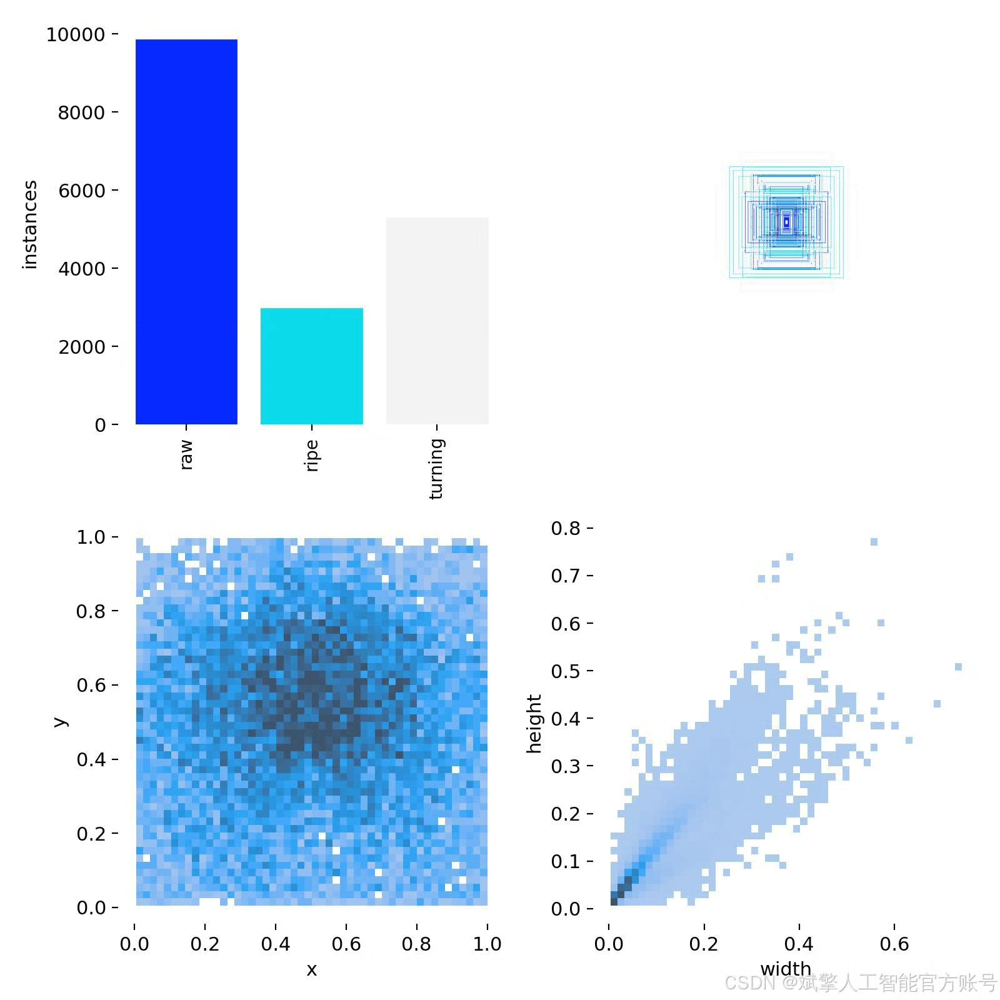
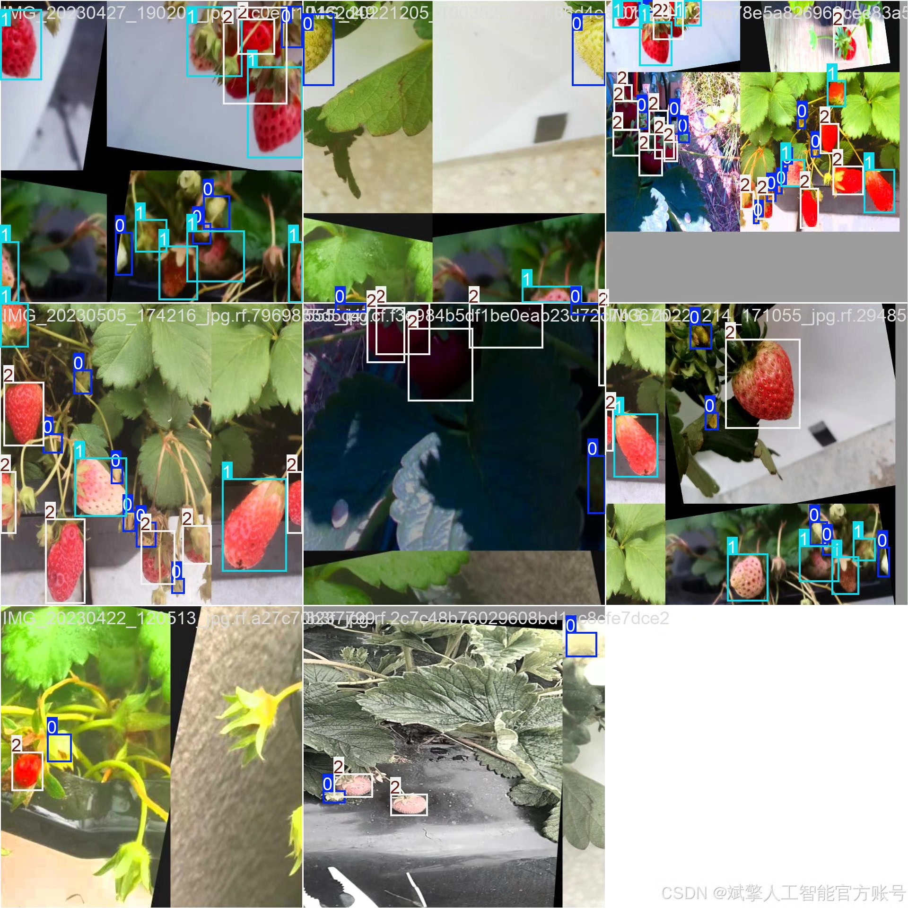
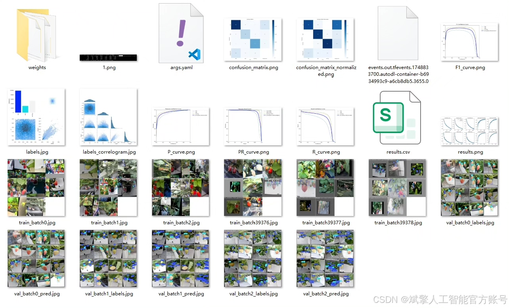
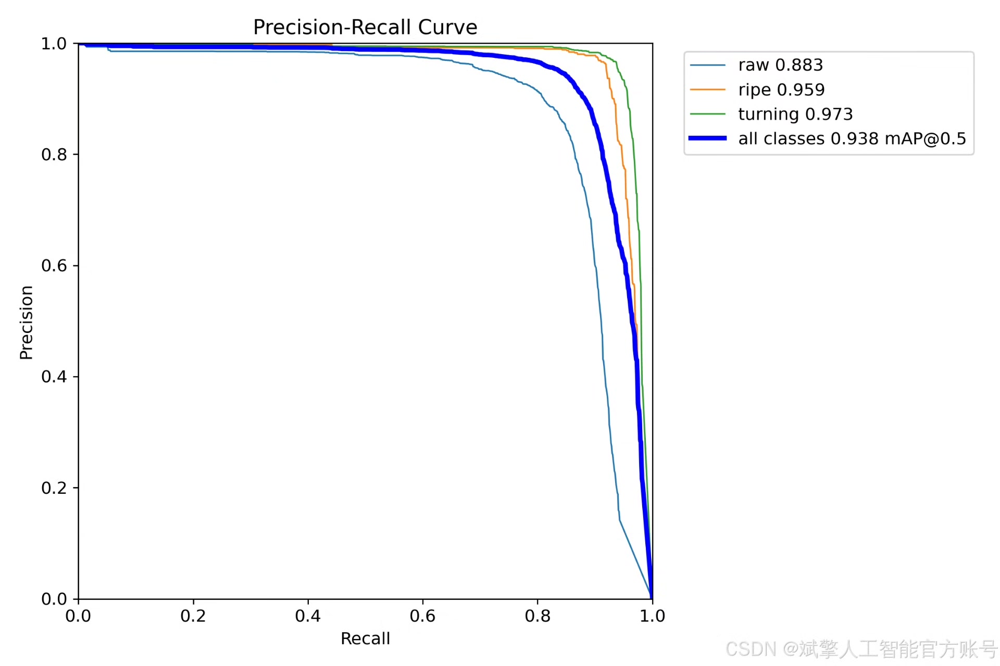
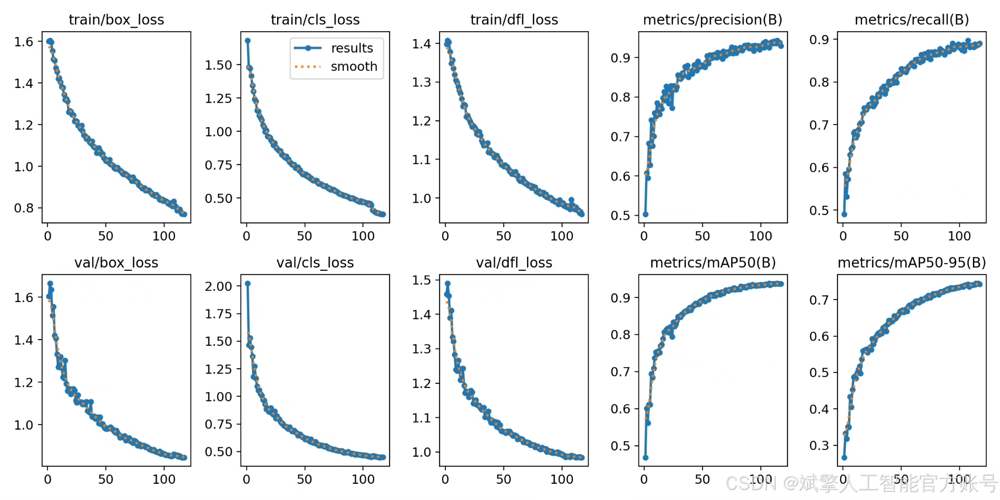
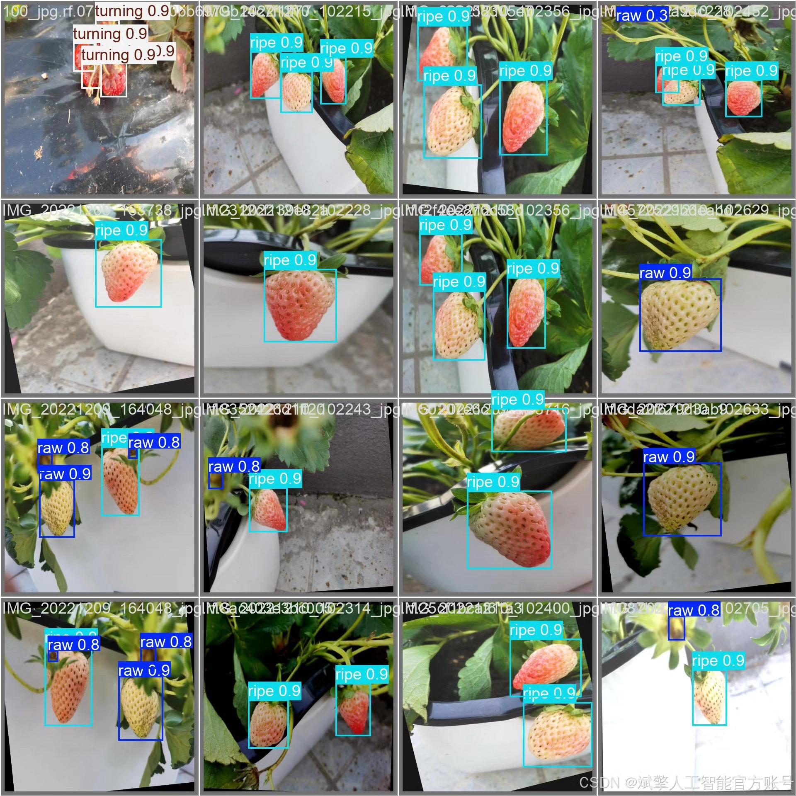

# YOLOv12 Strawberry Maturity Detection System

## Body

YOLOv12 Strawberry Maturity Detection System Based on Deep Learning YOLOv12 (YOLOv12+YOLO dataset + UI interface + login registration interface + Python project source code + model)

This project has constructed a strawberry maturity recognition detection system based on deep learning YOLOv12, aiming to achieve high-precision, real-time detection and classification of strawberries at different maturity stages. The system uses the YOLO format dataset, classifying strawberries into three categories: raw, turning, and ripe, using 2939 training set images and 774 validation set images for model training and verification. The model achieves precise recognition of strawberries of different sizes and angles under the YOLOv12 framework combined with multi-scale feature extraction and optimized anchor box mechanism.

✅ User Login and Registration: Supports password checking and security verification.
✅ Three Detection Modes: Based on the YOLOv12 model, supports image, video, and real-time camera detection, accurately recognizing targets.
✅ Dual Screen Comparison: Displays the original scene and detection results on the same screen.
✅ Data Visualization: Real-time table displaying the category, confidence, and coordinates of detected targets.
✅ Intelligent Parameter Tuning: Offers a confidence slide bar, dynamically optimizing detection accuracy to meet different scene requirements.
✅ Sci-Fi Interactive Interface: Dark theme paired with dynamic light effects, reducing visual fatigue and improving operational experience.

## Images

## Payment

Here is a pay link on Stripe ( https://buy.stripe.com/3cs8yP7sY87d0vu9AB ). Please contact me lonlonago@foxmail.com after funding $89, and I will send you a complete data files , thank you!

